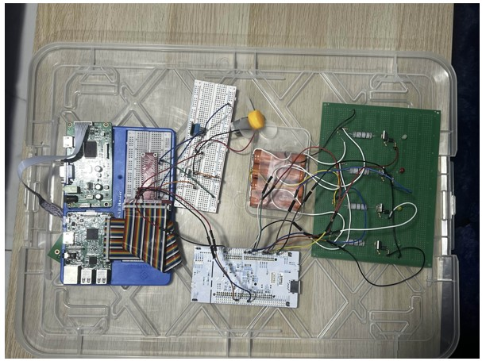
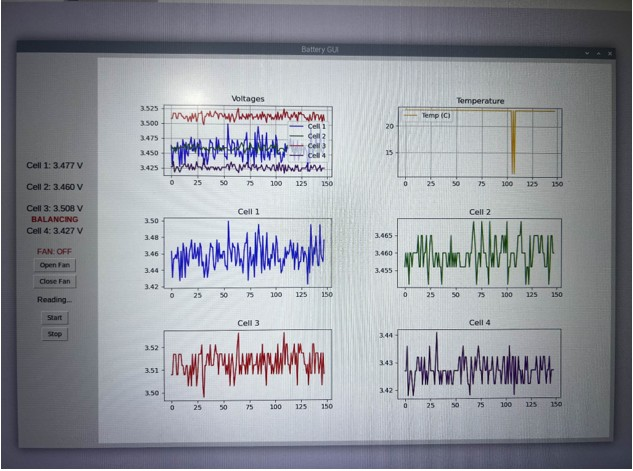
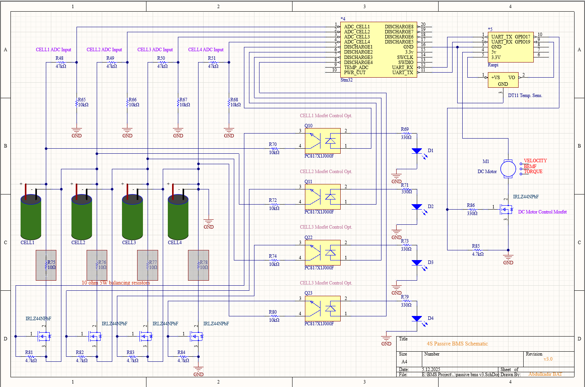
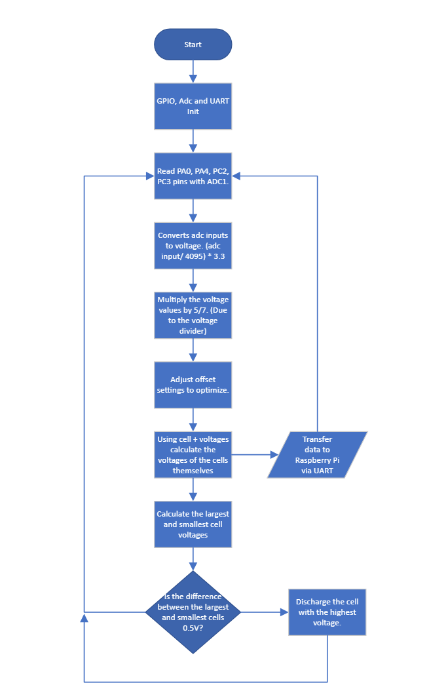
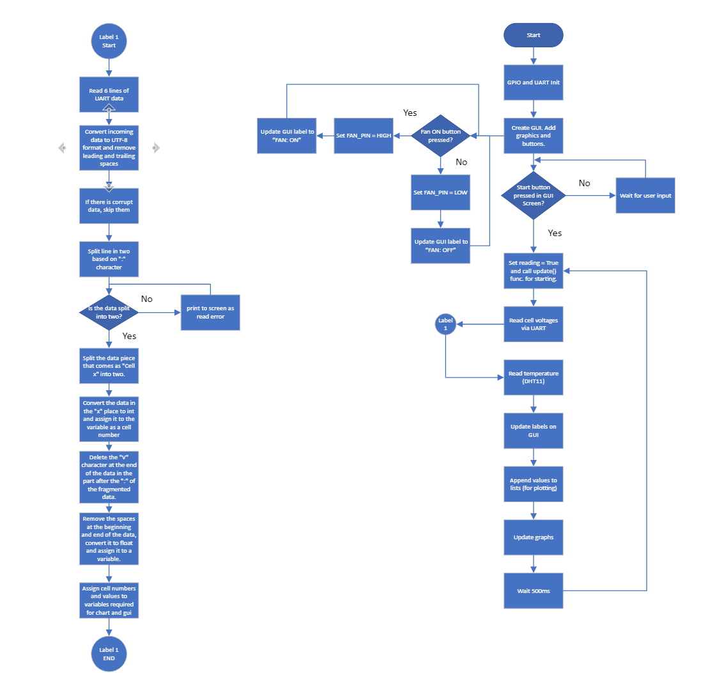
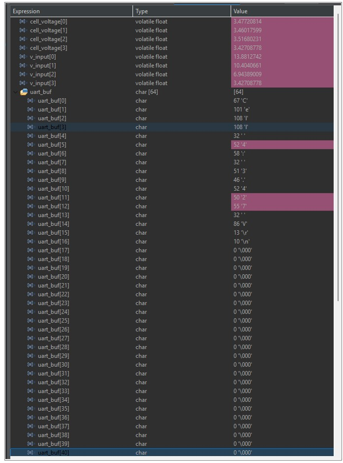
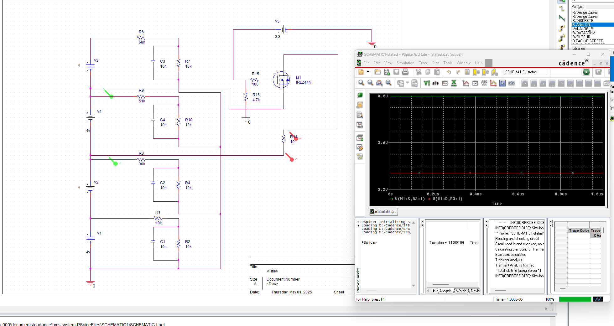
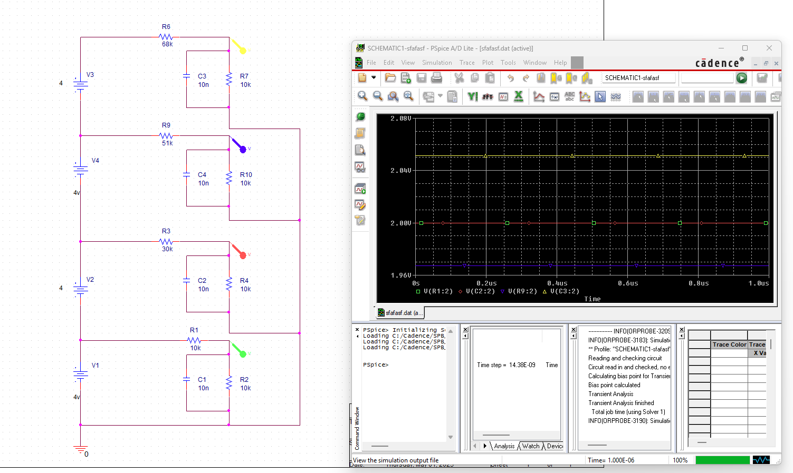

# 🔋 Battery Management System (BMS)
---

## 📌 Overview

A 4-cell lithium-ion battery management system based on **passive balancing**, built with an **STM32F4** microcontroller and a **Raspberry Pi**.

Since the Raspberry Pi lacks a built-in ADC, all voltage measurements are handled by the STM32. Each cell's positive terminal is connected to an ADC input through a voltage divider (scales down to max 2.3V) to protect the STM32's 3.3V GPIO pins. The STM32 averages 128 ADC samples per cell for software filtering, performs passive balancing via MOSFETs, and transmits data to the Raspberry Pi over UART. The Raspberry Pi visualizes everything in a live GUI dashboard and controls a cooling fan.

---

## ✅ Features

- Real-time voltage monitoring of 4 series Li-ion cells
- 128-sample ADC averaging per cell (software filtering)
- Passive cell balancing: discharges highest cell if voltage difference ≥ 33mV
- N-channel logic-level MOSFETs with optocoupler isolation for balancing
- UART communication (115200 baud) between STM32 and Raspberry Pi
- DHT11 ambient temperature monitoring (Raspberry Pi)
- DC fan control via N-channel MOSFET (Raspberry Pi GPIO17)
- Live voltage and temperature graphs (Python GUI — tkinter + matplotlib)
- Manual fan ON/OFF control from GUI

---

## 🖥️ System Architecture

```
┌─────────────────────────────────────────────────────┐
│               4S Li-ion Battery Pack                 │
│          Cell1 | Cell2 | Cell3 | Cell4               │
└──────────────┬──────────────────────────────────────┘
               │ Voltage Dividers (47kΩ / 4.7kΩ)
               │ Max 2.3V per pin
               ▼
      ┌──────────────────────┐
      │      STM32F4xx        │
      │  • ADC1 (PA0,PA4,    │
      │    PC2, PC3)          │
      │  • 128-sample avg     │
      │  • Balancing MOSFETs  │
      │    (optocoupler iso.) │
      │  • UART1 PA9/PA10     │
      └──────────┬───────────┘
                 │ UART 115200 baud
                 │ "Cell X: x.xxx V"
                 ▼
      ┌──────────────────────┐
      │     Raspberry Pi      │
      │  • Python GUI         │
      │  • Live graphs        │
      │  • DHT11 (GPIO19)     │
      │  • Fan ctrl (GPIO17)  │
      └──────────────────────┘
```

---

## 🗂️ Project Structure

```
BMS-Project/
│
├── README.md
│
├── STM32/
│   └── stm32_uart.txt          # STM32F4 firmware (C)
│
├── RaspberryPi/
│   └── BMS_Project.txt         # Python GUI application
│
└── images/
    ├── BMS_Schematic.png
    ├── circuit.jpg
    ├── adc_input_sim.png
    ├── bms_mosfet_test.png
    ├── bms_vds_vgs_graphs.png
    ├── mosfet_sim.png
    ├── raspi_flowchart.png
    ├── stm32_flowchart.png
    ├── STM32_debugger_screen.jpg
    └── system_graph.jpg
```

---

## Hardware

| Component | Detail |
|---|---|
| Microcontroller | STM32F4xx |
| Single Board Computer | Raspberry Pi |
| Temperature Sensor | DHT11 (GPIO19) |
| Battery | 4S Li-ion cell pack |
| Balancing Method | Passive (MOSFET + resistor) |
| MOSFET Isolation | Optocouplers |
| Voltage Divider | 47kΩ / 4.7kΩ (max 2.3V input) |
| UART Baud Rate | 115200 |
| ADC Pins | PA0, PA4, PC2, PC3 |
| UART Pins | PA9 (TX), PA10 (RX) |
| Fan Control | GPIO17 (Raspberry Pi) |

---

## Images

### Physical Circuit


### System Running (GUI + Circuit)


### BMS Schematic


### STM32 Flowchart


### Raspberry Pi Flowchart


### STM32 Debugger Live Expressions


### MOSFET Simulation (Cadence)


### ADC Input Simulation


---

## STM32 Firmware Details

- ADC1 reads 4 cells on PA0, PA4, PC2, PC3
- 128-sample averaging per cell for noise reduction
- Voltage formula: `(adc / 4095.0) × 3.3 × 5.7` (accounts for voltage divider)
- Cell voltages calculated from cumulative tap points
- Balancing activates when `Vmax − Vmin ≥ 33mV`
- MOSFET of highest-voltage cell turns on until difference drops below threshold
- Data sent via UART1: `Cell 1: 3.477 V\r\n`

## Raspberry Pi GUI Details

- Reads UART lines starting with `"Cell"`
- Parses cell number and voltage value
- Reads DHT11 temperature every 500ms
- Plots 6 live graphs: all-cells combined, temperature, and each cell individually
- Manual fan ON/OFF via GPIO17

---

## Dependencies (Raspberry Pi)

```bash
pip install pyserial matplotlib RPi.GPIO Adafruit_DHT
```

---

## How to Run

1. Flash `STM32/stm32_uart.txt` to STM32F4 using STM32CubeIDE
2. Connect STM32 PA9 (TX) → Raspberry Pi RX
3. Connect STM32 PA10 (RX) → Raspberry Pi TX
4. On Raspberry Pi run:
```bash
python3 RaspberryPi/BMS_Project.txt
```
5. Click **Start** on the GUI to begin reading

---

## 📊 Results

The system successfully monitored 4 Li-ion cells in real time with stable voltage readings around 3.42–3.51V per cell. Passive balancing activated correctly when the voltage difference between cells exceeded the 33mV threshold.
